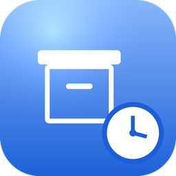

# BackBurner Post Archiver

**Automatically move old content out of active circulation after a configurable age — without ever deleting anything or breaking a single URL.**

[Features](#-what-it-does) · [Installation](#-installation) · [FAQ](#-frequently-asked-questions) · [License](#-license)

---

BackBurner Post Archiver quietly retires old content from the parts of your site where "latest" matters — the homepage, category and tag archives, search results, and your RSS feed — once it passes an age threshold you choose. Nothing is deleted. Anyone with a direct link, a bookmark, or an existing search ranking can still open an archived post exactly as before; it simply stops surfacing in listings of your newest content.

Free to download and use, and [live on the WordPress.org Plugin Directory](https://wordpress.org/plugins/backburner-post-archiver/).

## ⬇️ Installation

| What it is | Get it |
| --- | --- |
| WordPress plugin *(PHP, no build step)* | [**BackBurner Post Archiver on WordPress.org**](https://wordpress.org/plugins/backburner-post-archiver/) — free, install from wp-admin → Plugins → Add New, or download the zip directly |

1. Upload the `backburner-post-archiver` folder to `/wp-content/plugins/`, or install the zip through the WordPress Plugins screen.
2. Activate the plugin through the "Plugins" screen in WordPress.
3. Go to Settings → BackBurner to configure your age threshold, post types, and category/tag scope.
4. Leave "Dry Run" enabled and use "Run now" to preview what would be archived before switching it off.

## ✨ What it does

- 📅 Set a single site-wide age threshold (in months) after which content is archived.
- 🗂️ Choose exactly which post types are included (Posts, Pages, Media, Products, and any other public custom post type).
- 🏷️ Restrict archiving to specific categories and/or tags, or run it site-wide.
- 🙅 Mark any individual post "Never auto-archive this post" to permanently exempt it, regardless of age.
- 📦 Archived content is moved to a dedicated "Archived" status — never trashed or deleted.
- 🙈 Archived posts are automatically excluded from the homepage, category/tag archives, internal search, and the RSS feed.
- 🔗 Archived posts keep their original permalink and load normally (no redirects, no 404s) for anyone visiting directly.
- ↩️ Un-archive any post at any time from the normal status dropdown in the post editor.
- 🧪 Built-in Dry Run mode — preview exactly which posts would be archived before changing anything live.
- ⏱️ Runs automatically once a day via WP-Cron, or on demand with a "Run now" button.
- 🔌 A master Enabled switch so the whole feature can be turned off instantly without losing your configuration.

**Recommended workflow:** install and activate (it does nothing until you turn it on) → run Dry Run scoped to a single small category → review the results and mark any posts that should never be archived → turn off Dry Run for a normal, real run.

## ❓ Frequently Asked Questions

**Does this delete anything?**
No. BackBurner never deletes content. It changes a post's status to "Archived" so it stops appearing in listings of new/latest content. The post itself, its media, and its URL are untouched.

**Will archived posts 404 or redirect?**
No. An archived post's permalink continues to load exactly as it did before — full content, no redirect, no 404 — for any visitor who reaches it directly.

**Can I stop a specific post from ever being archived?**
Yes. Every post has a "Never auto-archive this post" option.

**Does this affect my SEO?**
Archived posts keep their canonical URL and stay in your XML sitemap. BackBurner only changes where the post appears within your own site (homepage/archives/search/RSS) — it does not add `noindex`, does not redirect, and does not remove the post from your sitemap.

## 📦 Source in this repository

This repository mirrors the plugin's WordPress.org SVN layout — the current release in `trunk/` and past tagged versions in `tags/` — for transparency and direct download. Grab a zip of any version straight from `tags/`, or the latest from `trunk/`, if you'd rather not go through wp-admin.

## 🐛 Support

Found a bug or have a feature request? Use the [WordPress.org support forum](https://wordpress.org/support/plugin/backburner-post-archiver/) or [get in touch](https://techygeekshome.info/contact/).

## 📄 License

BackBurner Post Archiver is free to download and use. This repository is proprietary freeware, not an open-source project — see [LICENSE](LICENSE) for the full terms. (The copy distributed via the official WordPress Plugin Directory is licensed GPLv2-or-later, as required by wordpress.org — see the note in [LICENSE](LICENSE).)

© 2026 TechyGeeksHome | Andrew Armstrong.

---

Made with ❤️ by [**TechyGeeksHome**](https://techygeekshome.info)

[Website](https://techygeekshome.info) · [YouTube](https://www.youtube.com/channel/UCtEuFj1SMLiuRoucD1hv8dA) · [X](https://x.com/TechyGeeks1) · [Facebook](https://www.facebook.com/techygeeks.home) · [Instagram](https://www.instagram.com/andrewarmstrongtgh/)

